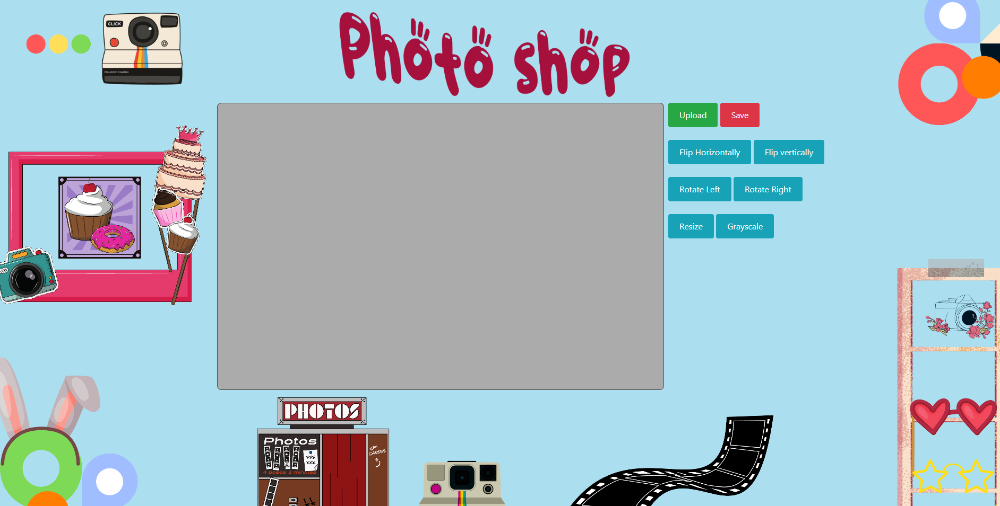
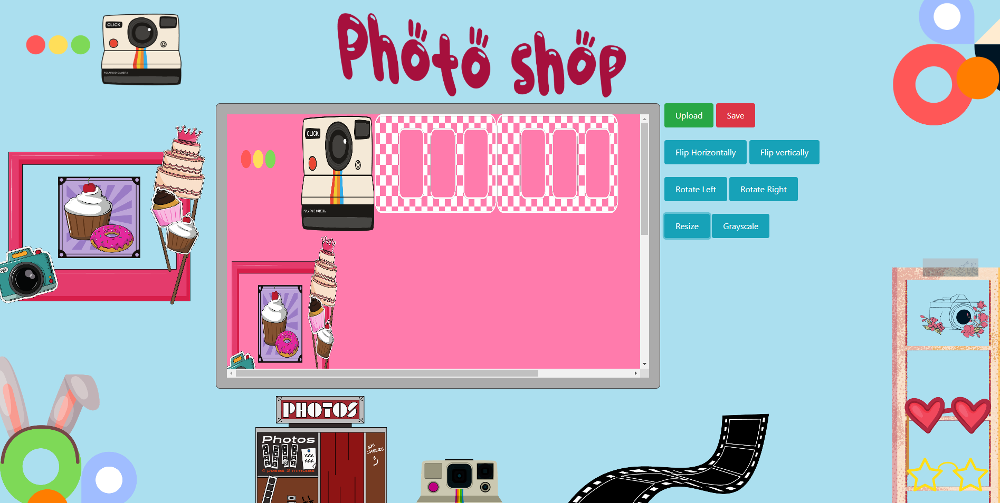

# Photo Shop

This is a JavaScript-based image editor that uses 3D arrays to perform basic image manipulation operations. The project allows you to upload, save, resize, flip, rotate (both left and right), and apply greyscale effects to images.

## Table of Contents

- [Introduction](#introduction)
- [Features](#features)
- [Prerequisites](#prerequisites)
- [Output](#output)
- [How it Works](#how-it-works)
- [Usage](#usage)
- [Note](#note)

## Introduction

This project is a JavaScript image editor that leverages 3D arrays to manipulate images. It provides a simple interface for performing various image editing operations, such as resizing, flipping, rotating, and applying greyscale effects.

## Features

- Upload images from your local device.
- Save edited images with a default filename (you can customize it further).
- Resize images to specified dimensions.
- Flip images horizontally or vertically.
- Rotate images both left and right.
- Apply greyscale effects to images.

## Prerequisites

Before using this image editor, you should have a basic understanding of:

- JavaScript for Canvas .
- How images are represented as pixel matrices.

## Output

**Description**: Photo editor with basic functionality.

**Description**: Here, after the image is uploaded, I have resized the image, so that's what it looks like.

## How it Works

The image editor operates on the concept of 3D arrays:

- The image is loaded into an HTML Canvas, which stores pixel data in a 1D array.
- The 1D array is converted into a 3D array to represent the image as a matrix of pixels.
- Various image manipulation functions modify the 3D array.
- The 3D array is converted back into a 1D array to display the edited image on the Canvas.

Please note that due to the conversion between 1D and 3D arrays, there may be a slight delay when applying effects, especially for larger images.

## Usage

1. Clone this repository to your local machine.

2. Open `index.html` in your web browser.

3. Use the following functions:

   - **Upload Image**: Select an image file from your device to edit.
   - **Save**: Save the edited image. Only default filename supported.
   - **Resize**: Change the dimensions of the image.
   - **Flip**: Flip the image horizontally or vertically.
   - **Rotate**: Rotate the image left or right.
   - **Greyscale**: Apply a greyscale effect to the image.

4. Experiment with different editing options to modify the image.

## Note

- This project is not responsive and is still under development, optimized for desktop-size displays.

## LINK TO THE PROJECT WEBSITE
https://santacionx.github.io/Photoshop/
